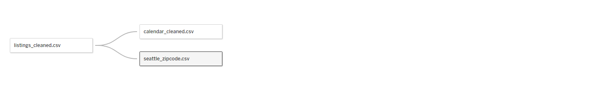
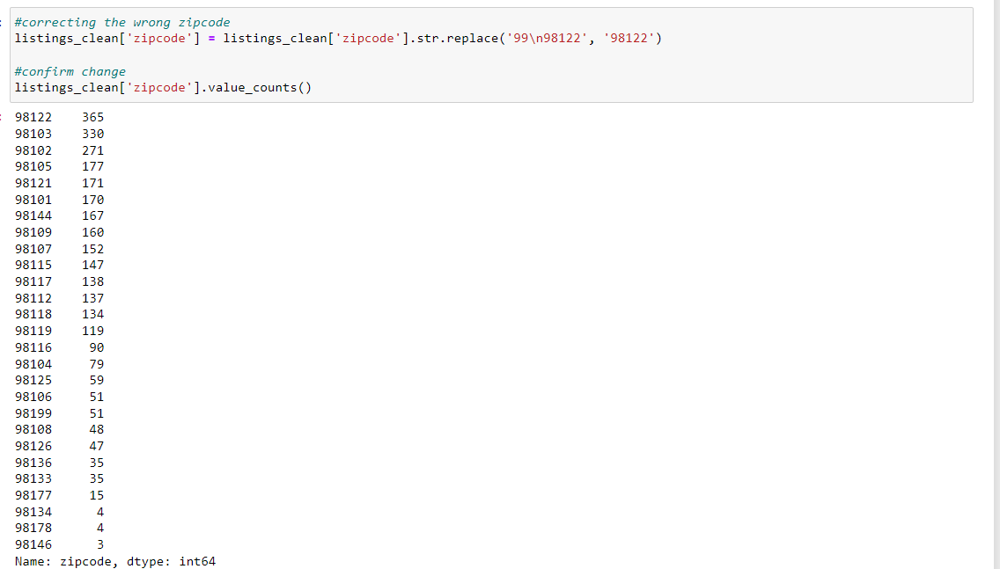
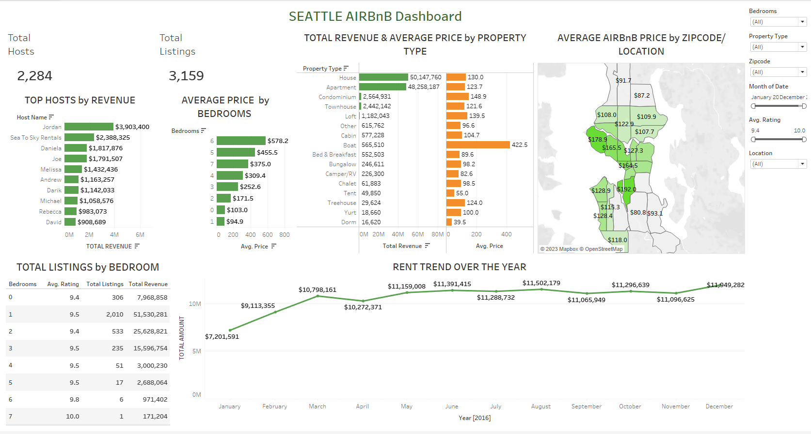
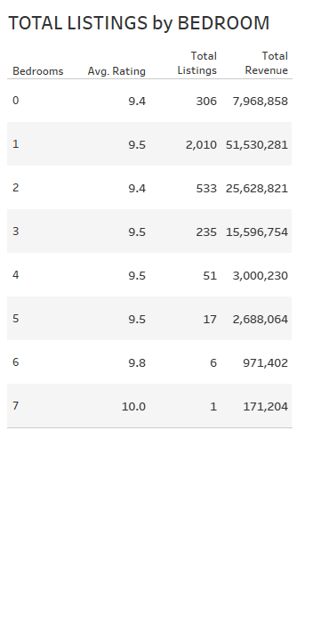
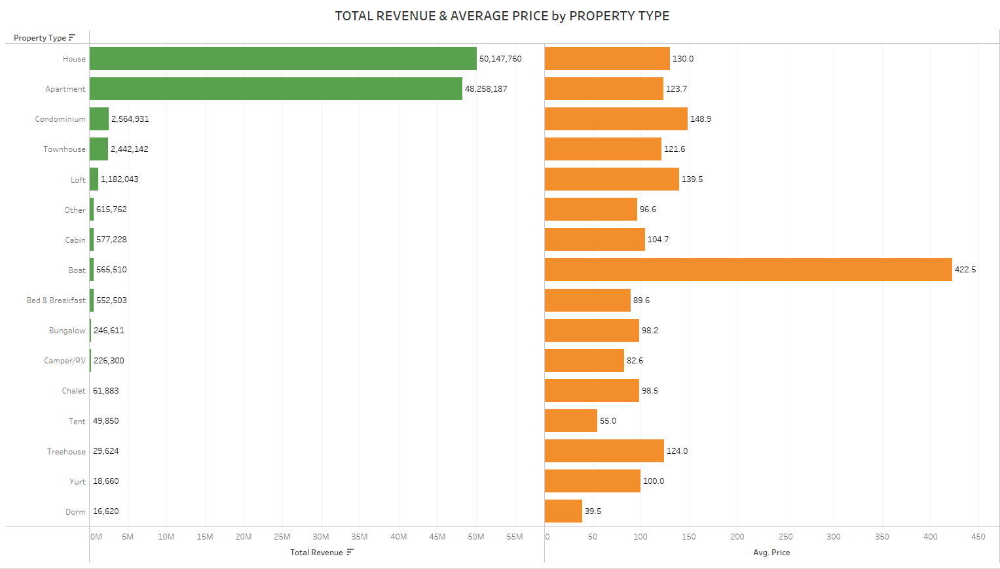
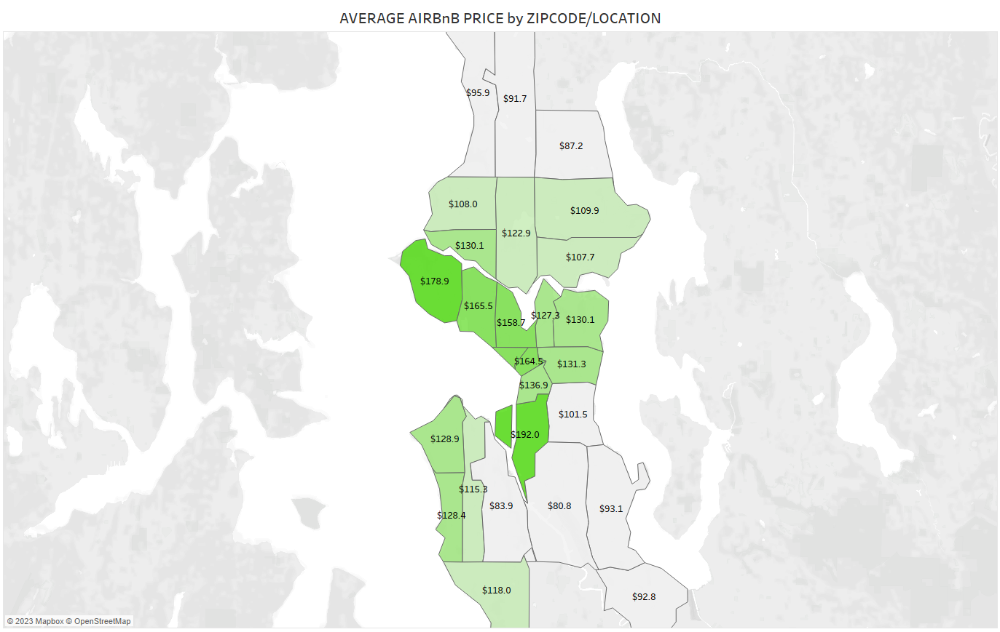

# Seattle-AirBnB-Analysis
## by Kola Ademola

___
## INTRODUCTION
___
Since 2008, guests and hosts have used Airbnb to travel in a more unique, personalized way. As part of the Airbnb Inside initiative, this dataset describes the listing activity of homestays in Seattle, WA. I cleaned the dataset using Python first before moving it to Tableau for Visualizations.

### PROBLEM STATEMENT
I would love to use this dataset to gain insight into the following;
* How many Hosts & Listings are present in Seattle?
* The Top Hosts.
* The average price of listings depending on the number of bedrooms and their ratings.
* Which property type costs more on average.
* Which locations(zipcode) costs more on average.
* AirBnB trend over the year.
___
## DATA SOURCE
___
The dataset is from [AirBnB](http://insideairbnb.com/get-the-data.html). The following Airbnb activity is included in this Seattle dataset:

* Listings, including full descriptions and average review score
* Calendar, including listing id and the price and availability for that day
___
## DATA MODELLING
___
The dataset is not a complex one since it's just 2 tables;

___
## SKILLS DEMONSTRATED
___
In this project I cleaned the data with Python using pandas and other functions;  
___LIBRARIES USED___

___DATA CLEANING___

___

___

___

___

___

___
## ANALYSIS & VISUALIZATIONS
___
This report contains only one dashboard;  
___DASHBOARD___

* HOW MANY AIRBnB HOSTS & LISTINGS ARE PRESENT IN SEATTLE?

___
* TOP EARNING AIRBnB HOSTS IN SEATTLE?

___
* AVERAGE AIRBnB PRICE BY BEDROOMS & THEIR RATINGS?

___
* WHICH PROPERTY TYPE COSTS MORE?

___
* WHICH LOCATIONS DO AIRBnB COST MORE?

___
* AIRBnB RENT TREND OVER THE YEAR(2016)

___
## CONCLUSIONS & RECCOMMENATIONS
___
From my analysis I come to the following conclusions;
* There is a total of **2,284 Hosts & 3,159 AirBnB Listings** in Seattle.
* **Jordan** is the highest earning Host, having generated **$3.9M+** in revenue from AirBnB.
* As expected the AirBnB price increases as the number of bedrooms icreases as well, but its a surprise to see a Listing with no bedroom cost more than a listing with 1 bedroom;
> I also noticed that the number of listings decreases as the number of bedrooms increases,  
> 1 bedroom have the highest number of listings,
> 1 & 2 bedrooms generates the most revenue,  
> 6 & 7 bedrooms have higher ratings.  
* **Boats** are the most expensive AirBnB to rent probably because there are yatchs, followed by **Condos**. But **House & Apartments** generates the most revenue.
* The area with zipcode **98134: SoDo / Industrial District** is the most expensive area with average AirBnB at **$192**, followed by **98199: Magnolia** at **$178.9**.
* We can see a steady increase in revenue over the months, but it peaks at the end of the year, and I would guess its because of the holidays when people tend to travel more.
___
### RECCOMMENDATIONS
Here are my reccommendations;
* **SoDo / Industrial District** & **Magnolia** are the best locations for some looking to start AirBnB.
* **1 bedroom / 2 bedrooms** is the best option to rent out as there generate the most revenue and also the most popular choice.
* Investing in the **House & Apartments** property type will be a good choice as they tend to generate more revenues, but having a **Boat / Condo** would'nt be bad as they cost more as well.
* Renting out our AirBnB from August or at the End of the year will be a good idea as that is when demand increases.

Thank you for goin through this report till the end.  
__Kola Ademola__
